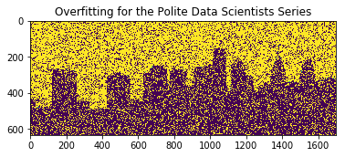

# LAN 2018 AI@Philadelphia
## Meetup Title
Free Data Science Course: Ensemble Methods
## Where
TBD

## When
Wednesday, October 3rd

### Start Time
4:30 PM
### End Time
5:30 PM
## Description
[Being Updated]
[The slides will be uploaded on here after the session.](https://github.com/lotusxai/LAN-Workshops)

### Topics for study before Meetup
* Voting and Averaging
* Stacking
* Bootstrap Aggregating
* Boosting
* AdaBoost
* Model Interpretability
* Overfitting & Ensemble Techniques
* CPU Utilization
* Rstudio Sparklyr
* Amazon EMR

This group meeting is from **Overfitting for the Polite Data Scientists** Series that combines the power of Kaggle and its publicly available Data and Kernels with the computing resources hosted by Amazon computing network knowns at AWS or Amazon Web Services. In each group meeting, competing models sharing a common Data are being ran and their results are being discussed. More information about the data and the slides are shared before hand to increase engagement and participations of anyone who shows-up.

## For Who:
This session is more technical than the first session but still either of the following groups should find the sessions useful:

Researchers and Professionals from Technical backgrounds in Data Engineering, Statistics or Computer Science background will see few winning models from Kaggle compete.

Secondly, the future talents that are coming from a diverse background, technically or ethnically, and are willing to re-generate the results and learn by-doing. This is the best way that I know to learn Data Science and with all the buzz that is going on in Machine Learning and Data Science I am aiming to build a content accessible for free. The codes will be made available here for your practice using LAN Github Repo and AWS resources. You won't need anything else besides a keen wanting for building and learn-by-doing. AWS and (recently Kaggle) account are available for Free and you can leverage these recourses from day one. The reproduction costs are based on Free Tier units on AWS and as of now are free (some conditions apply).
